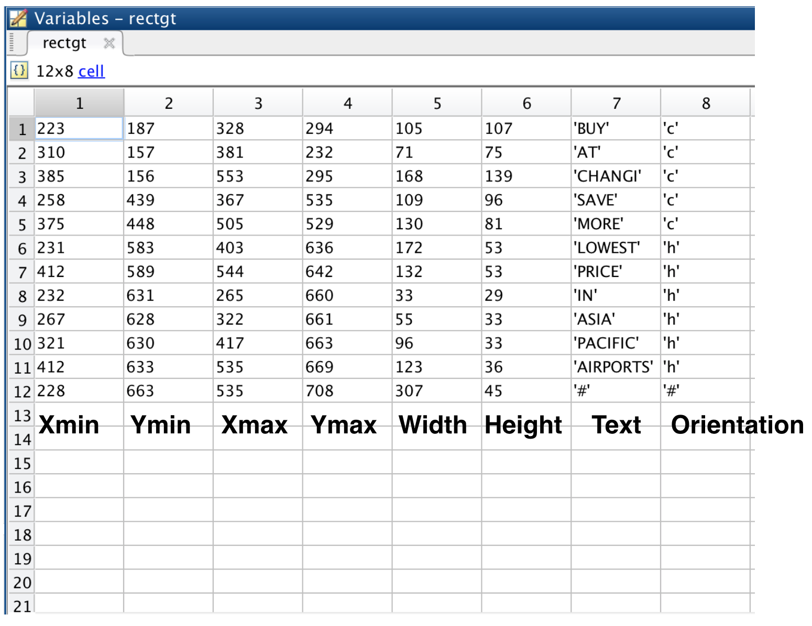

## Description

The groundtruth of Total-Text dataset can be downloaded through the following link:

(http://www.cs-chan.com/source/ICDAR2017/groundtruth-text.zip).

## Text-level Annotation (Text Detection)

There are two(2) folders:

a) Polygon - Our proposed polygon-shaped bounding region

b) Rectangular - Conventional rectangular bounding box

## GroundTruth Format

