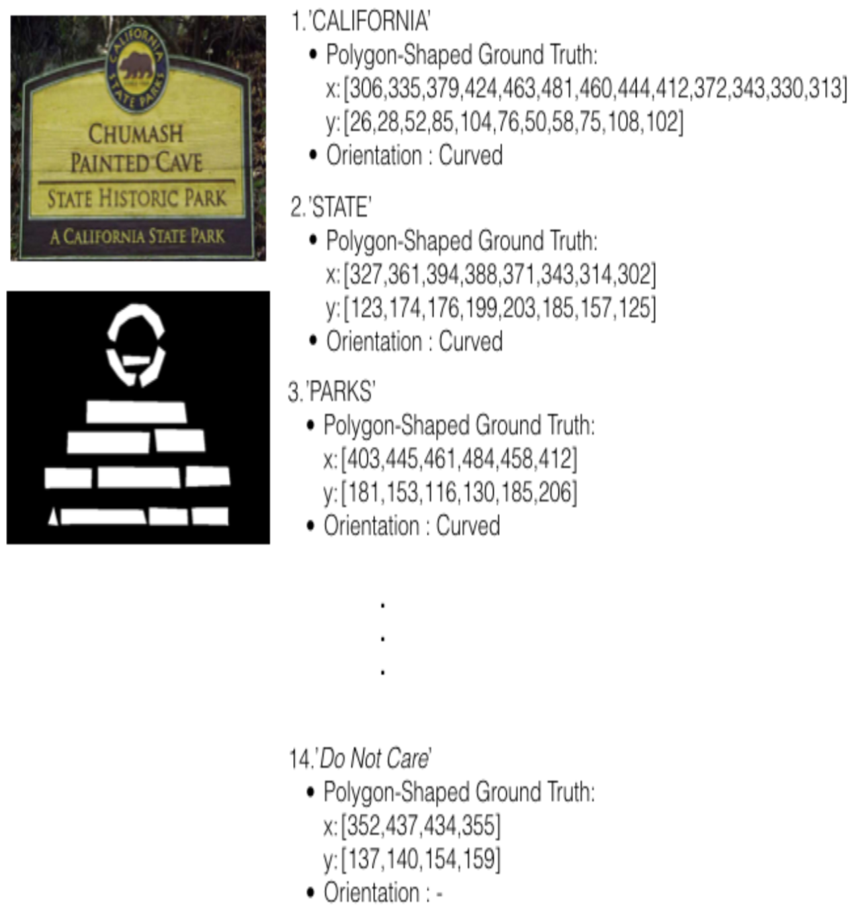

## Description

Updates:
New training ground truths of Total-Text is now available, they are refined with the following attributes:
1) Polygon bounding region with fixed number of vertex (10 vertex),
2) The first point of the polygon bounding region is annotated according to the reading sequence of the text (i.e., top left corner of the annotated text).

More information can be found in our [IJDAR journal](https://link.springer.com/article/10.1007/s10032-019-00334-z) (as refered to in the main page). 

The groundtruth of the Total-Text dataset can be downloaded through the following links. 

Latest refined version:
 - at [this https URL](https://drive.google.com/open?id=1-XrQBoU9as1PXaB_0dUrDTJgvGFFOnDE)

Legacy version:
- at [this https URL](https://drive.google.com/file/d/1v-pd-74EkZ3dWe6k0qppRtetjdPQ3ms1/view?usp=sharing) for text file format('.txt').

- at [this https URL](https://drive.google.com/file/d/19quCaJGePvTc3yPZ7MAGNijjKfy77-ke/view?usp=sharing) for Matlab format ('.mat'). Can be load with Matlab, scipy.io.loadmat, etc..

There are two(2) folders:

### Polygon - Our proposed polygon-shaped bounding region
The format is
* Column 1-2 = X-coordinate
* Column 3-4 = Y-coordinate
* Column 5 = Text
* Column 6 = Orientation (c=curve; h=horizontal; m=multi-oriented; #=dont care)

### Rectangular - Conventional rectangular bounding box
The format is
* Column 1 = X-min
* Column 2 = Y-min
* Column 3 = X-max
* Column 4 = Y-max
* Column 5 = Width
* Column 6 = Height
* Column 7 = Text
* Column 8 = Orientation (c=curve; h=horizontal; m=multi-oriented; #=dont care)
