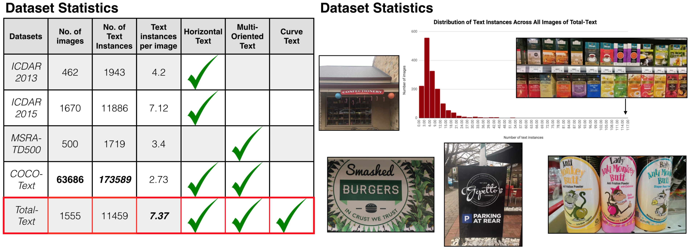

# Total-Text-Dataset

Updated on November 26, 2018 (Table ranking is included for reference.)

Updated on August 24, 2018 (Newly added [annotation tool](https://github.com/cs-chan/Total-Text-Dataset/tree/master/Annotation_tools) folder.)

Updated on May 15, 2018 (Added groundtruth in '.txt' format.)

Updated on May 14, 2018 (Added feature - 'Do not care' candidates filtering is now available in the latest python scripts.)

Updated on April 03, 2018 (Added pixel level groundtruth)

Updated on November 04, 2017 (Added text level groundtruth)

Released on October 27, 2017

## Table Ranking

- The results from recent papers on the Total-Text dataset are listed.

### Detection (based on DetEval evaluation protocol, unless stated)
| Method     |  Precision (%)  |  Recall (%)  |   F-measure (%)     |   Published at    |
|:--------:  | :-----:   | :----:      |  :-----:     |    :-----:    |
|MSR [[paper]](https://arxiv.org/abs/1901.02596)        | 85.2     |  73.0       |    78.6     |         arXiv:1901.02596    |
|FTSN [[paper]](https://arxiv.org/abs/1709.03272)        | 84.7     |  78.0       |    81.3     |          ICPR2018    |
|TextSnake [[paper]](http://openaccess.thecvf.com/content_ECCV_2018/papers/Shangbang_Long_TextSnake_A_Flexible_ECCV_2018_paper.pdf)| 82.7     |  74.5       |    78.4      |     ECCV2018        | 
|TextField [[paper]](https://arxiv.org/pdf/1812.01393.pdf)     | 81.2     |  79.9   |    80.6      | TIP      |
|CTD [[paper]](https://www.sciencedirect.com/science/article/pii/S0031320319300664)     | 74.0     |  71.0   |    73.0      | PR2019         |
|Mask TextSpotter [[paper]](http://openaccess.thecvf.com/content_ECCV_2018/papers/Pengyuan_Lyu_Mask_TextSpotter_An_ECCV_2018_paper.pdf)     | 69.0     |  55.0       |    61.3      |      ECCV2018         |
|TextNet [[paper]](https://arxiv.org/abs/1812.09900)     | 68.2     |  59.5       |    63.5      |      ACCV2018         |
|Textboxes [[paper]](https://arxiv.org/abs/1611.06779)             | 62.1     |  45.5       |    52.5      |        AAAI2017      |
|EAST [[paper]](https://arxiv.org/abs/1704.03155)             | 50.0     |  36.2       |    42.0      |        CVPR2017      |
|Baseline [[paper]](http://cs-chan.com/doc/ICDAR17.pdf)  | 33.0     |  40.0      |    36.0     |   ICDAR2017          |
|SegLink [[paper]](https://arxiv.org/abs/1703.06520)             | 30.3     |  23.8       |    26.7      |        CVPR2017      |

### End-to-end Recognition (None refers to recognition without any lexicon; Full lexicon contains all words in test set.)
| Method     |  None (%)  |  Full (%)  |   Published at    |
|:--------:  | :-----:   | :----:      |    :-----:    |
|TextNet [[paper]](https://arxiv.org/abs/1812.09900)     | 54.0     |  -    |      ACCV2018         |
|Mask TextSpotter [[paper]](http://openaccess.thecvf.com/content_ECCV_2018/papers/Pengyuan_Lyu_Mask_TextSpotter_An_ECCV_2018_paper.pdf)  | 52.9     |  71.8      |    ECCV2018          |
|Textboxes [[paper]](https://arxiv.org/abs/1611.06779)        | 36.3     |  48.9       |         AAAI2017    |

(Note that these results are extracted from respective published papers. If your result is missing or incorrect, please do not hesisate to contact us.)

## Description

In order to facilitate a new text detection research, we introduce the Total-Text dataset [(ICDAR-17 paper)](https://arxiv.org/abs/1710.10400) [(presentation slides)](http://cs-chan.com/doc/TT_Slide.pdf), which is more comprehensive than the existing text datasets. The Total-Text consists of 1555 images with more than 3 different text orientations: Horizontal, Multi-Oriented, and Curved, one of a kind.




## Citation
If you find this dataset useful for your research, please cite
```
@inproceedings{CK2017,
  author    = {Chee Kheng Ch’ng and
               Chee Seng Chan},
  title     = {Total-Text: A Comprehensive Dataset for Scene Text Detection and Recognition},
  booktitle = {14th IAPR International Conference on Document Analysis and Recognition {ICDAR}},
  pages     = {935--942},
  year      = {2017},
  doi       = {10.1109/ICDAR.2017.157},
}
```

## Feedback
Suggestions and opinions of this dataset (both positive and negative) are greatly welcome. Please contact the authors by sending email to
`chngcheekheng at gmail.com` or `cs.chan at um.edu.my`.

## License and Copyright
The project is open source under BSD-3 license (see the ``` LICENSE ``` file). Codes can be used freely only for academic purpose.

Copyright 2018, Center of Image and Signal Processing, Faculty of Computer Science and Information Technology, University of Malaya.


