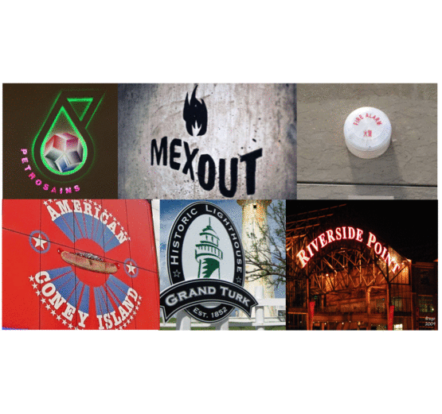

# Total-Text-Dataset

Updated on May 15, 2018 (Newly added groundtruth in '.txt' format.)

Updated on May 14, 2018 (Newly added feature - 'Do not care' candidates filtering is now available in the latest python scripts.)

Updated on April 03, 2018 (Added pixel level groundtruth)

Updated on November 04, 2017 (Added text level groundtruth)

Released on October 27, 2017

## Description

In order to facilitate a new text detection research, we introduce the Total-Text dataset [(ICDAR2017 paper)](https://arxiv.org/abs/1710.10400) [(presentation slides)](http://cs-chan.com/doc/TT_Slide.pdf), which is more comprehensive than the existing text datasets. The Total-Text consists of 1555 images with more than 3 different text orientations: Horizontal, Multi-Oriented, and Curved, one of a kind.




## Citation
If you find this dataset useful for your research, please cite
```
@inproceedings{CK2017,
  author    = {Chee Kheng Ch’ng and
               Chee Seng Chan},
  title     = {Total-Text: A Comprehensive Dataset for Scene Text Detection and Recognition},
  booktitle = {14th IAPR International Conference on Document Analysis and Recognition {ICDAR}},
  pages     = {935--942},
  year      = {2017},
  doi       = {10.1109/ICDAR.2017.157},
}
```

## Feedback
Suggestions and opinions of this dataset (both positive and negative) are greatly welcome. Please contact the authors by sending email to
`chngcheekheng at gmail.com`or `cs.chan at um.edu.my`.

## Lisense and Copyright
The project is open source under BSD-3 license (see the ``` LICENSE ``` file). Codes can be used freely only for academic purpose.

Copyright 2018, Center of Image and Signal Processing, Faculty of Computer Science and Information Technology, University of Malaya.


