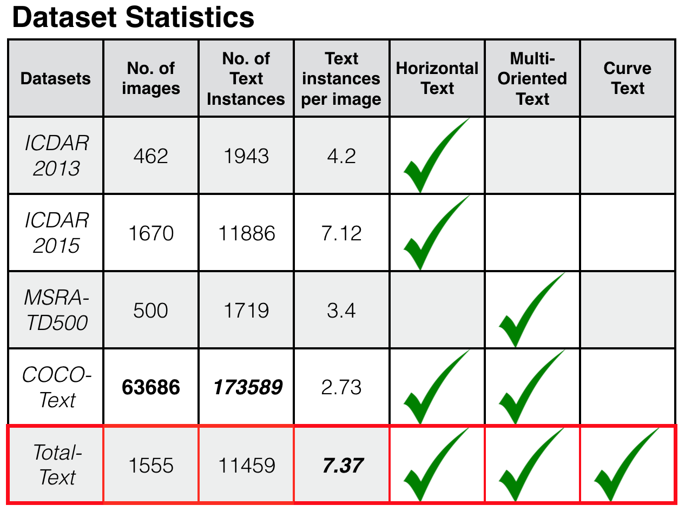

# Total-Text-Dataset

Released on October 27, 2017

## Description

In order to facilitate a new text detection research, we introduce the [Total-Text dataset](https://arxiv.org/abs/1710.10400) [(slides)](http://cs-chan.com/doc/TT_Slide.pdf), which is more comprehensive than the existing text datasets. The Total-Text consists of 1555 images with more than 3 different text orientations: Horizontal, Multi-Oriented, and Curved, one of a kind.




## Citation
If you find this dataset useful for your research, please cite
```
@inproceedings{CK2017,
  author    = {Chee Kheng Ch’ng and
               Chee Seng Chan},
  title     = {Total-Text: A Comprehensive Dataset for Scene Text Detection and Recognition},
  booktitle = {14th IAPR International Conference on Document Analysis and Recognition {ICDAR}},
  pages     = {},
  year      = {2017},
  doi       = {},
}
```

## Feedback
Suggestions and opinions of this dataset (both positive and negative) are greatly welcome. Please contact the authors by sending email to
`chngcheekheng at gmail.com`or `cs.chan at um.edu.my`.
